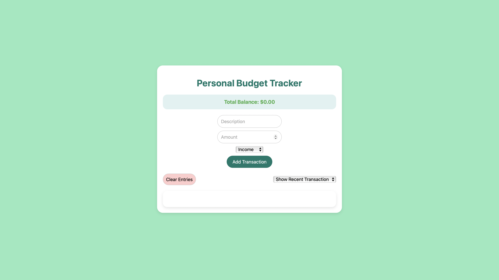

# Budget Tracker

## Description

The Budget Tracker is a simple yet effective application designed to help users manage their finances by tracking income and expenses. This application allows users to gain insights into their spending habits and savings goals.

## Screenshot

## Features

- **Add Income and Expenses:** Easily input your income sources and various expenses.
- **View Balance:** Automatically calculate and display the current balance based on your inputs.
- **Monthly Reports:** Generate monthly summaries of income, expenses, and savings.
- **User-Friendly Interface:** Simple and intuitive interface for ease of use.
- **Data Persistence:** Store data locally to retain information between sessions.

## Technologies Used

- **Programming Language:** C++
- **Development Environment:** Visual Studio Code / Xcode / Any C++ IDE
- **Libraries:** 

## Contributions are welcome! 

## License

- This project is licensed under the MIT License. See the LICENSE file for details.

## Acknowledgments

- Inspired by the need to manage personal finances efficiently.
- Thanks to the open-source community for providing resources and support.

## Contact

If you have any questions or feedback, you can reach me through the following methods:

  
